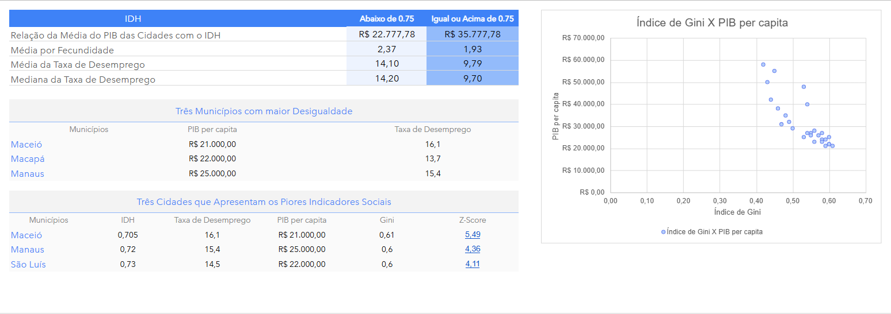

# Análise dos Dados Socioeconômicos dos Municípios

A análise foi realizada a partir da comparação entre municípios com **IDH abaixo de 0,75** e aqueles com **IDH igual ou superior a 0,75**, utilizando indicadores econômicos, sociais e demográficos disponíveis no conjunto de dados.

Pode-se observar na análise que municípios com IDH abaixo de 0,75 têm uma média de PIB per capita menor (R$ 22.777,78) do que aqueles com IDH igual ou superior (R$ 35.777,78). Isso mostra que um desenvolvimento humano mais baixo anda de mãos dadas com renda média menor. Além disso, esses municípios têm taxas de fecundidade mais altas, o que acelera o crescimento populacional e pode frear o PIB per capita.

Analisando desigualdade de renda (Índice de Gini) e PIB per capita, há uma relação inversa: quanto menor a renda média, maior a concentração de renda. Os municípios mais desiguais são Maceió, Macapá e Manaus, com PIB baixo e desemprego elevado, embora variem um pouco.

Para identificar os piores indicadores sociais no geral, criamos um índice de vulnerabilidade social. Padronizamos as variáveis (IDH, PIB per capita, desemprego e Gini), invertendo os sinais de IDH e PIB para que valores altos indiquem pior condição. Somando tudo, os mais vulneráveis são Maceió, Manaus e São Luís.

Diante desses desafios, sugerimos duas políticas federais: atrair empresas e estimular a economia (usando dados do CEMPRE/IBGE) para cortar o desemprego e fortalecer o trabalho local; e expandir creches públicas, especialmente nos municípios vulneráveis, para que mais mulheres entrem no mercado de trabalho, aumentem a renda familiar e reduzam desigualdades.
